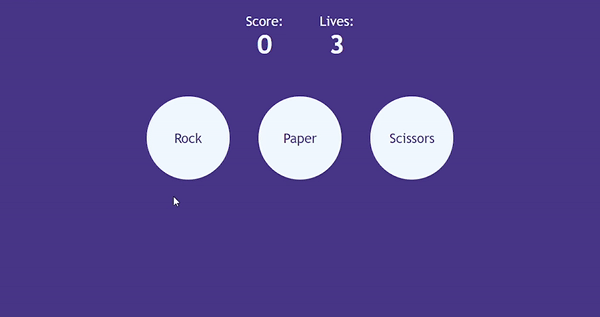

# Rock Papes Scissors Game!

A very simple rock-paper-scissors game!

This project was bootstraped with [Create React App](https://create-react-app.dev)
## Available Scripts

To check this project:

### `clone`
Clone the repository.

### `npm install`
Install the dependencies.

### `npm start`
Runs the app in the development mode.\
Open [http://localhost:3000](http://localhost:3000) to view it in your browser.

The page will reload when you make changes.\
You may also see any lint errors in the console.

## `Functions`
- Click on an option for the computer to calculate against a random number to win, lose or tie.
- Keep the score and lives.
- If you run out of lives, window changes to the end game with a restart button.
- if you win more than 3 times, window changes to the end game with a restart button.

